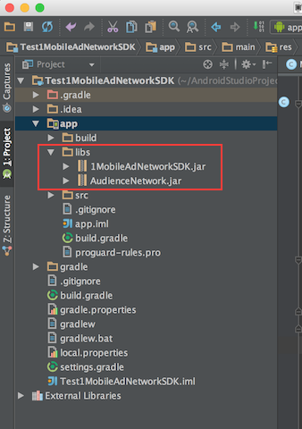

# 1Mobile AdNetwork SDK Guide v1.0

This guide shows you how to integrate the 1Mobile AdNetwork SDK.
*For a working implementation of this project see the `sample/` folder.*

# Getting started

## Add 1Mobile AdNetwork SDK and setup dependencies (For Android Studio)

  Step 1. Copy 1MobileAdNetworkSDK.jar and AudienceNetwork.jar files in the /libs folder in your project.
            
   

  Step 2. Add 1MobileAdNetworkSDK.jar, AudienceNetwork.jar and Google play service to the dependencies.
    *Add the following lines to your app's build.gradle:*
   
        dependencies {
            compile files('libs/1MobileAdNetworkSDK.jar')
            compile files('libs/AudienceNetwork.jar')
            compile 'com.google.android.gms:play-services-ads:8.1.0'
        }
     
## Setup application’s information

  Step 1. Setup your application’s 1Mobile AdNetwork {APP_ID} and {API_KEY} which you applied from 1Mobile AdNetwork Team.
    *Open AndroidManifest.xml file, and add the following lines:*
  
      <application
        android:allowBackup="true"
        android:label="@string/app_name">
        ...
        <meta-data android:name="OM_ADNETWORK_APP_ID"
            android:value="@string/om_adnetwork_app_id" />
        <meta-data android:name="OM_ADNETWORK_API_KEY"
            android:value="@string/om_adnetwork_api_key" />
        ...
      </application>
      
  Step 2. Then set the {APP_ID} and {API_KEY} values in strings.xml:
  
      <resources>
          <string name="om_adnetwork_app_id">1001</string>
          <string name="om_adnetwork_api_key">9bdf96b5d256d991bddc3bbf10d5e610</string>
      </resources>

## Configure your application Manifest.

  Step 1. Declare the INTERNET and ACCESS_NETWORK_STATE permissions:
            
      <manifest xmlns:android="http://schemas.android.com/apk/res/android"
          package=“com.onemobile.adnetwork">
        ...
        <uses-permission android:name="android.permission.INTERNET" />
        <uses-permission android:name="android.permission.ACCESS_NETWORK_STATE" />
        <uses-permission android:name="android.permission.READ_PHONE_STATE" />
        ...
      </manifest>

  Step 2. Declare the activities right before the closing application tag:
      
      <application
        android:allowBackup="true"
        android:label="@string/app_name">
        ...
          <receiver android:name="com.onemobile.adnetwork.nativead.receiver.NetworkChangeReceiver">
            <intent-filter>
                <action android:name="android.net.conn.CONNECTIVITY_CHANGE" />
            </intent-filter>
          </receiver>
          <receiver android:name="com.onemobile.adnetwork.nativead.receiver.InstallReceiver">
            <intent-filter android:priority="2147483647">
                <action android:name="android.intent.action.PACKAGE_ADDED" />
                <data android:scheme="package" />
            </intent-filter>
          </receiver>
          <service
            android:name="com.onemobile.adnetwork.nativead.AdService"
            android:enabled="true" />
          <meta-data
            android:name="com.google.android.gms.version"
            android:value="@integer/google_play_services_version" />
          <activity
            android:name="com.google.android.gms.ads.AdActivity"
            android:configChanges="keyboard|keyboardHidden|orientation|screenLayout|uiMode|screenSize|smallestScreenSize"
            android:theme="@android:style/Theme.Translucent" />
          <activity
            android:name="com.facebook.ads.InterstitialAdActivity"
            android:configChanges="keyboardHidden|orientation|screenSize" />
        ...
      </application>
      
# Banner Ads
This guide explains how to add banner ads to your app.

  Step 1. Edit the layout file of your Activity.
            
    <?xml version="1.0" encoding="utf-8"?>
    <RelativeLayout xmlns:android="http://schemas.android.com/apk/res/android"
        xmlns:tools="http://schemas.android.com/tools"
        android:layout_width="match_parent"
        android:layout_height="match_parent"
        tools:context=".MainActivity">
  
        <!-- Ad -->
        <LinearLayout
            android:id="@+id/adView"
            android:layout_width="match_parent"
            android:layout_height="wrap_content"
            android:layout_alignParentBottom="true"
            android:background="#ffffff"
            android:gravity="center"
            android:orientation="horizontal" />
  
    </RelativeLayout>

  Step 2. Instantiate an AdViewLayout object and make a request to load an ad. Since AdViewLayout is a subclass of View, 
  you can add it to your view hierarchy just as with any other view.
  
      @Override
      protected void onCreate(Bundle savedInstanceState) {
          super.onCreate(savedInstanceState);
          setContentView(R.layout.activity_main);
          
          // Find the parent layout in your activity.
          LinearLayout adViewLayout = (LinearLayout) this.findViewById(R.id.adView);
          // New an AdView.
          AdViewLayout adView = new AdViewLayout(this, "1"); // FIXME set your slot id 
          // Then add it to the parent layout.
          adViewLayout.addView(adView);
      }
  
  Note. *Different place ad must have a different slot id, you must set your slot id in arguments of new AdViewLayout(this, "1").  Slot id is specified by yourself and it must be a integer that greater than 0.*
  

# Native Ads
The Native Ad API allows you to build a customized experience for the ads you show in your app. 
When using the Native Ad API, instead of receiving an ad ready to be displayed, you will receive a group of ad properties such as a title, an image, a call to action, and you will have to use them to construct a custom view where the ad is shown.
  
  Step 1. Create a function that requests a native ad:
            
    @Override
    protected void onCreate(Bundle savedInstanceState) {
        super.onCreate(savedInstanceState);
        setContentView(R.layout.activity_main);
        
        NativeAd nativeAd = new NativeAd(this, "2"); // FIXME set your slot id
        nativeAd.setAdListener(new AdListener() {
            @Override
            public void onError(Ad ad, AdError error) {
            }
  
            @Override
            public void onAdLoaded(Ad ad) {
                if (ad != null) {
                    //Fill your ad content into your layout
                    fillAdContent(ad);
                }
            }
  
        });
        nativeAd.setClickType(AdConstants.AD_CLICK_TYPE_CUSTOM);
        nativeAd.loadAd();
    }

  Step 2. Extract the ad metadata and use its properties to build your customized native UI. For example:
  
    private void fillAdContent(Ad ad) {
        View container = (View) findViewById(R.id.nativeAdView);
        ImageView iv = (ImageView) container.findViewById(R.id.group_item_icon);
        TextView name = (TextView) container.findViewById(R.id.group_item_name);
        TextView size = (TextView) container.findViewById(R.id.group_item_size);
        name.setText(ad.title);
        size.setText(ad.size);
        String imageUrl = ad.iconUrl;
        String bannelUrl = ad.bannelUrl;
        //show your image or bannel here with the imageUrl or bannelUrl
        .....
        //register your clickable view with the ad click event.
        nativeAd.registerViewForInteraction(container, new AdClickListener() {
            @Override
            public void onAdClicked(Ad ad) {
                Toast.makeText(MainActivity.this, "Ad Click", Toast.LENGTH_SHORT).show();
            }
        });
    }

  Note. *The SDK will log the impression and handle the click automatically. 
  Please note that you must register the ad's view with the nativeAd instance to enable that. 
  Registering the view using nativeAd.registerViewForInteraction() will make the whole view clickable.*
  
    nativeAd.registerViewForInteraction(container, new AdClickListener() {
        @Override
        public void onAdClicked(Ad ad) {
            Toast.makeText(MainActivity.this, "Ad Click", Toast.LENGTH_SHORT).show();
        }
    });

  
   